# Utility experiment — paper draft (simplified)

## 1. Goal

We test a simple question: **does mining only “vitalizing” issues lead to better process models than mining the full log or a random sample?**

A *vitalizing* issue is one that was active in a week flagged as abnormal by the closure detector. We compare three logs and use **F1-score** (balance of fitness and precision) as the main quality measure.

---

## 2. Setup

**Three logs** (all issue-centric, same preprocessing):

| Log | Cases | Events | How it was built |
|-----|------:|-------:|------------------|
| Whole | 1,097 | 11,838 | All issues in the repository |
| Vitalizing | 246 | 2,621 | Issues linked to 25 anomaly weeks |
| Random control | 246 | 2,575 | 246 cases sampled from the whole log (seed 40) |

**Preprocessing (same for all three):**

1. Drop incomplete traces (last event must be `closed` or `head_ref_deleted`).
2. Drop traces where one activity repeats more than 5 times in the same case.
3. Build the random log by drawing **246 case IDs without replacement** from the cleaned whole log, so it has the **same number of cases** as the vitalizing log.

**Discovery and evaluation:** Alpha Miner, Heuristics Miner, and Inductive Miner (IM and IMf) in PM4Py. Each model is scored with replay **fitness**, ETC **precision**, harmonic **F1**, and **generalization**.

---

## 3. Sensitivity and reproducibility

**Parameter sensitivity:** We varied Heuristics dependency (0.6–0.9) and Inductive noise (0.3–0.6). On the vitalizing log, Heuristics F1 stayed almost flat:

| Heuristics dependency threshold | F1 (vitalizing) |
|------------------------------:|----------------:|
| 0.6 | 0.72 |
| 0.7 | 0.72 |
| 0.8 | 0.72 |
| 0.9 | 0.72 |

**Random seed check:** We resampled the random control **10 times** (seeds 0–9) and rediscovered models each time. F1 on the random log stayed stable (low spread), e.g. Heuristics: mean **0.57**, SD **0.05**.

---

## 4. Results

**Table 2 — Discovery quality (F1, fitness, precision)**

| Miner | Metric | Random | Vitalizing | Whole |
|-------|--------|-------:|-----------:|------:|
| Alpha | F1 | 0.21 | **0.33** | 0.20 |
| Alpha | Fitness | 0.76 | 0.68 | 0.62 |
| Alpha | Precision | 0.12 | **0.22** | 0.12 |
| Heuristics | F1 | 0.50 | **0.72** | 0.54 |
| Heuristics | Fitness | 0.84 | 0.79 | 0.85 |
| Heuristics | Precision | 0.36 | **0.65** | 0.40 |
| Inductive IM | F1 | 0.22 | 0.23 | 0.21 |
| Inductive IM | Fitness | 1.00 | 1.00 | 1.00 |
| Inductive IM | Precision | 0.13 | 0.13 | 0.12 |
| Inductive IMf (noise 0.3) | F1 | 0.27 | **0.51** | 0.40 |
| Inductive IMf (noise 0.3) | Fitness | 0.93 | 0.94 | 0.96 |
| Inductive IMf (noise 0.3) | Precision | 0.16 | **0.35** | 0.26 |

Bold = best F1 or best precision among the three logs for that miner.

**Main takeaway:** For every miner, the vitalizing log matches or **beats** both baselines on F1. The largest gap is under **Heuristics** (0.72 vs ~0.50–0.54). Alpha and IMf also improve clearly; plain Inductive IM stays low on all logs because precision is poor despite perfect fitness.

**Figure (recommended for the paper):** Re-run the utility notebook plotting cell to export `clean_log_f_score_grouped_bars.png` — grouped bars of F1 by miner, one colour per log (vitalizing / random / whole). Caption example: *“F1-score of discovered models on three issue logs (Commitizen). Vitalizing sublog consistently matches or exceeds random and whole-log baselines.”*

```mermaid
xychart-beta
    title "F1-score by miner (higher is better)"
    x-axis ["Alpha", "Heuristics", "Inductive IM", "IMf 0.3"]
    y-axis "F1" 0 --> 0.8
    bar "Vitalizing" [0.33, 0.72, 0.23, 0.51]
    bar "Random" [0.21, 0.50, 0.22, 0.27]
    bar "Whole" [0.20, 0.54, 0.21, 0.40]
```

---

## One-sentence summary

Selecting vitalizing issues does **not** hurt discovery quality; on this dataset it **raises F1** compared with the full log and a case-matched random sample, especially for Heuristics Miner.
